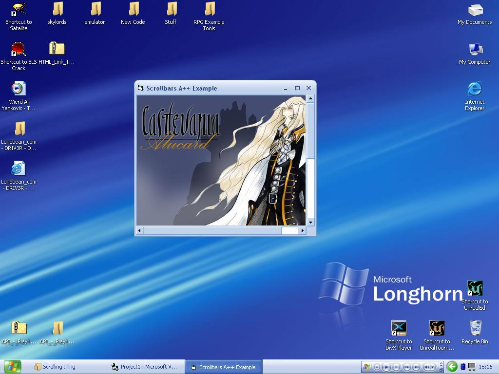



## Scrollbars A\+\+ Example

### Description

This is my first submission to PSC so be nice :). I decided to make this example because all of the other examples were too hard for new coders to understand, or they were all part of something bigger (full programs). Click the picture to load up another one. Also there is some help with the commondialog (for new coders). Hope you all get what you need from this, please vote :D.
 
### More Info
 

             |
---                |---
**Submitted On**   |2005-01-23 10:29:02
**By**             |[\_\]D\-Angel\[\_](https://github.com/Planet-Source-Code/PSCIndex/blob/master/ByAuthor/d-angel.md)
**Level**          |Beginner
**User Rating**    |5.0 (25 globes from 5 users)
**Compatibility**  |VB 3\.0, VB 4\.0 \(16\-bit\), VB 4\.0 \(32\-bit\), VB 5\.0, VB 6\.0
**Category**       |[Coding Standards](https://github.com/Planet-Source-Code/PSCIndex/blob/master/ByCategory/coding-standards__1-43.md)
**World**          |[Visual Basic](https://github.com/Planet-Source-Code/PSCIndex/blob/master/ByWorld/visual-basic.md)
**Archive File**   |[Scrollbars1843281232005\.zip](https://github.com/Planet-Source-Code/d-angel-scrollbars-a-example__1-58456/archive/master.zip)

